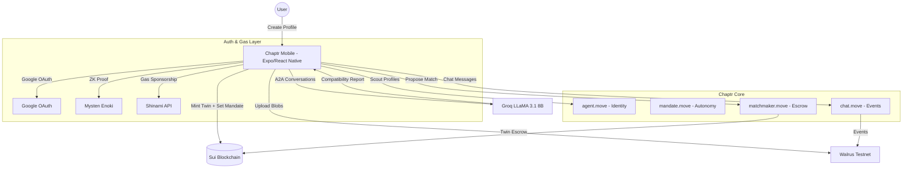
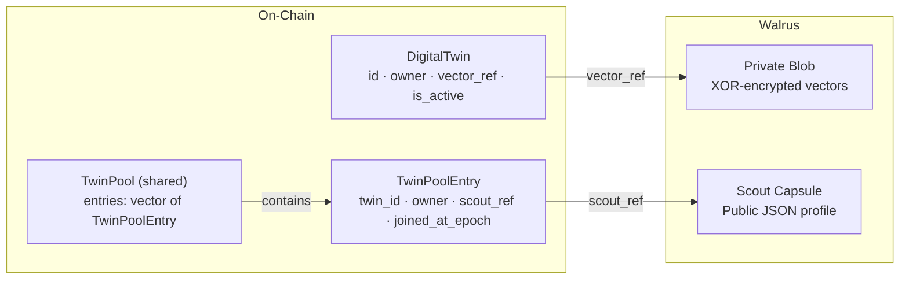
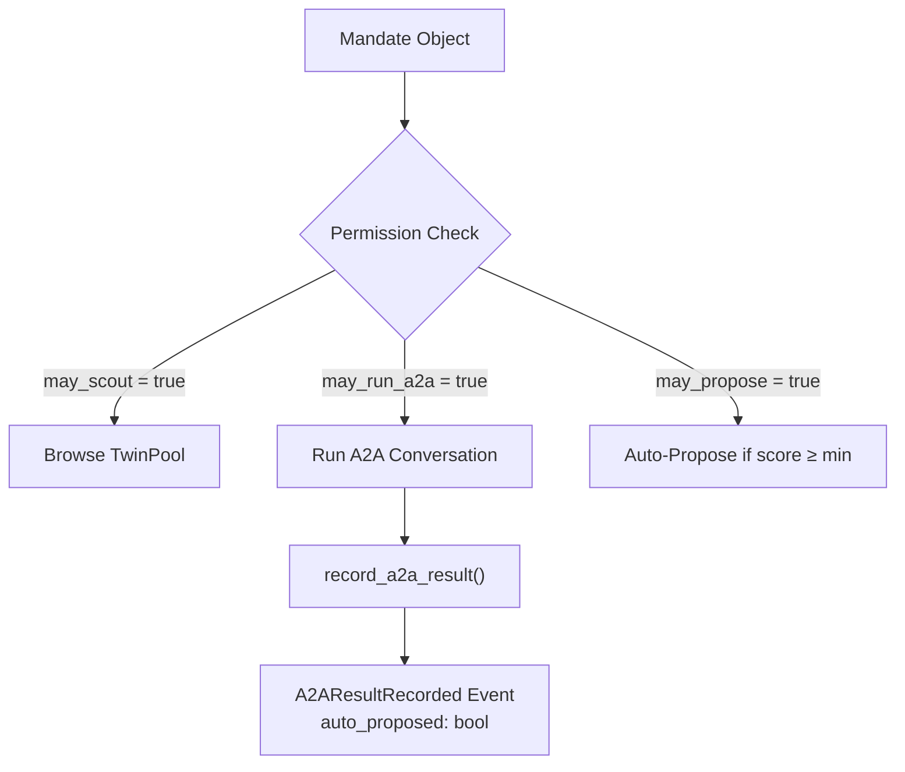
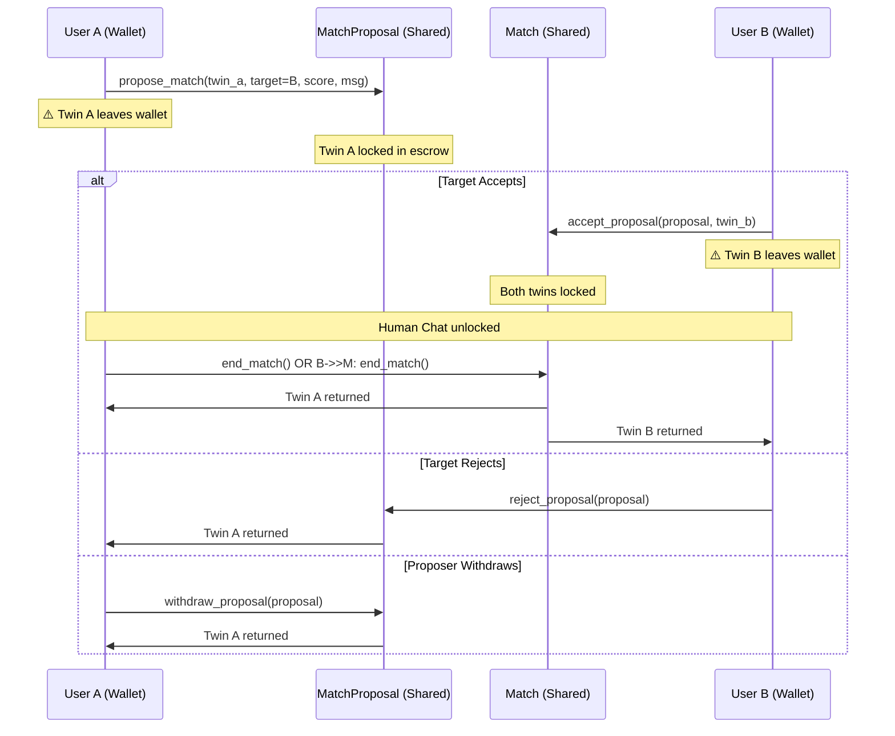
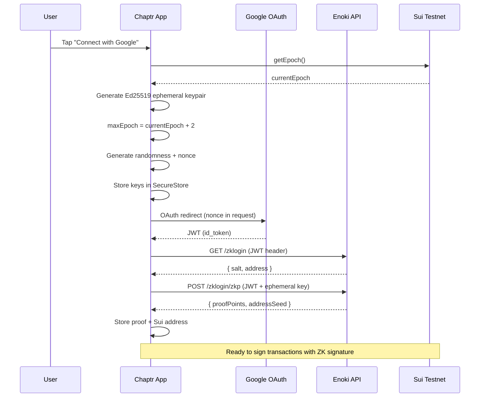
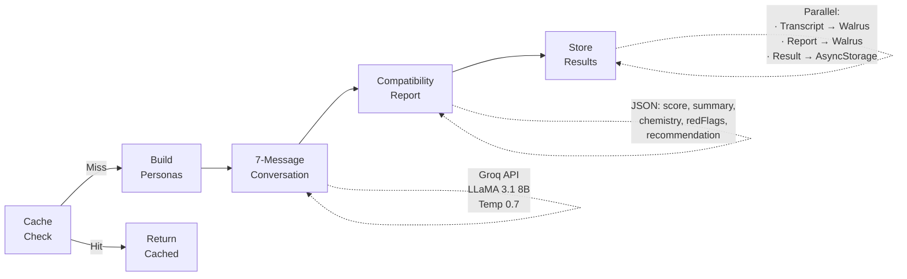
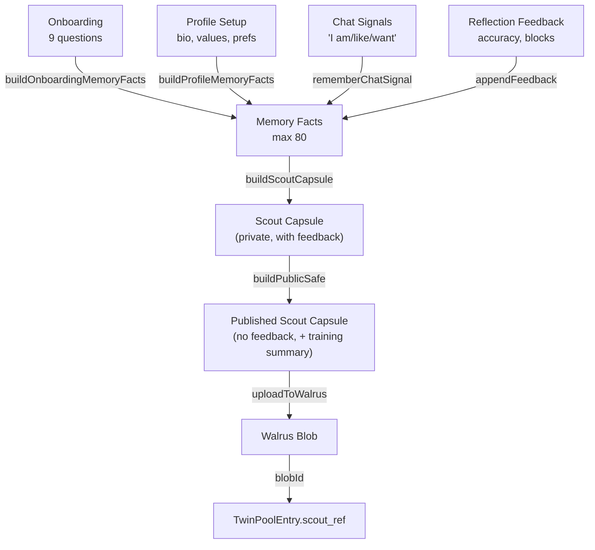

# 💜 Chaptr: The Agentic AI Matchmaking Protocol

Chaptr is a next-generation **AI-first matchmaking platform** built on the Sui blockchain. It bridges autonomous AI agents with on-chain identity, scoped permissions, and escrow-based matching.

---

## 🏛️ Architecture Overview

Chaptr is designed as a modular, three-layer system where each component has a distinct responsibility:

### High-Level System Flow


### Component Breakdown

1. **Chaptr Mobile App (React Native)**: The "Command Center". Premium UI for profile setup, Twin training, scouting, A2A conversations, proposals, human chat, and reflection feedback.
2. **Smart Contracts (Sui Move)**: The "Protocol". On-chain identity (DigitalTwin NFTs), scoped autonomy (Mandates), physical escrow matching, and event-based messaging.
3. **AI Engine (Groq)**: The "Brain". Runs multi-turn A2A conversations between Digital Twins to assess compatibility autonomously.
4. **Twin Memory (TypeScript)**: The "Memory". 80 personality facts, Scout Capsules (public dating profiles), and feedback-driven learning loops.
5. **Walrus Storage**: The "Vault". Decentralized blob storage for scout capsules, personality vectors, A2A transcripts, chat messages, and safety reports.
6. **Shinami Gas Station**: The "Fuel". Invisible gas sponsorship for a completely gasless user experience via secure backend routing.

---

## 🔬 Technical Deep-Dive

### 1. Digital Twin Identity (`agent.move`)

The DigitalTwin is a Sui object with `key` and `store` abilities, making it transferable and **wrappable** by value into other objects.



**Key Functions:**
- `mint_agent_and_register(pool, private_ref, scout_ref)` — Primary onboarding: mint Twin + add to pool
- `update_scout_ref(pool, new_ref)` — Update public profile after Twin learning
- `update_vector(agent, new_ref)` — Update private personality data
- `deactivate_agent(agent)` — Soft delete

**Init**: Creates a single shared `TwinPool` object at package publish time.

### 2. Scoped Autonomy (`mandate.move`)

The Mandate defines **what a Twin can do autonomously**. It's deliberately **loosely coupled** from the DigitalTwin — no import, no reference. This is because when a Twin is locked in escrow (Match/Proposal), the Mandate must remain accessible in the wallet for updates.



**Mandate Fields:**
| Field | Type | Description |
|-------|------|-------------|
| `may_scout` | `bool` | Twin can browse profiles |
| `may_run_a2a` | `bool` | Twin can initiate AI conversations |
| `may_propose` | `bool` | Twin can auto-propose matches |
| `min_score_to_propose` | `u8` | Minimum score threshold (70–99) |
| `last_a2a_partner` | `address` | Last A2A conversation partner |
| `last_a2a_score` | `u8` | Last A2A compatibility score |
| `a2a_transcript_ref` | `String` | Walrus blob ID of conversation transcript |
| `a2a_report_ref` | `String` | Walrus blob ID of compatibility report |

### 3. Escrow-Based Matching (`matchmaker.move`)

This is the most architecturally significant module. It uses **physical object wrapping as an exclusivity mechanism**.



**Constants:**
- `MIN_SCORE: u8 = 70` — Minimum similarity score to propose

**Why this works:** The `store` ability on `DigitalTwin` allows it to be consumed by value and embedded as a field in `MatchProposal` and `Match`. When your Twin is inside a proposal, it **literally doesn't exist in your wallet** — making double-proposals impossible at the object model level, not just application logic.

### 4. Event-Only Messaging (`chat.move`)

The chat module is deliberately minimal — a separate package with zero on-chain state:

```move
public entry fun send_message(match_id: address, blob_id: String, ctx: &mut TxContext) {
    event::emit(MessageSent {
        match_id,
        sender: ctx.sender(),
        blob_id,
        sent_at: tx_context::epoch(ctx),
    });
}
```

- **No objects created** — chat history is reconstructed by indexing `MessageSent` events
- **Message content on Walrus** — only the blob ID is emitted on-chain
- **No access control** — the app layer validates that the sender is a match participant
- **Separate package** — no dependency on `chaptr`, `match_id` is a raw address

### 5. zkLogin Authentication Flow



**Key Design Decisions:**
- **Epoch-bound sessions**: `maxEpoch = currentEpoch + 2` (~2 days), after which re-auth is needed
- **Platform-adaptive storage**: `expo-secure-store` on native, `localStorage` on web
- **Gasless Transactions**: Shinami Gas Station sponsors all transactions via a secure backend route (`/api/sponsor`), shielding users from gas fees and eliminating the need for a faucet.

### 6. A2A Conversation Pipeline (`aiEngine.js`)



**Persona Construction:** The system prompt for each Twin is built from their Scout Capsule — bio, lookingFor, communicationStyle, mustHave, dealBreaker.

**Conversation Structure:** Twin A opener (150 tokens) → 3 rounds of Twin B response + Twin A response → 7 total messages.

**Report Parsing:** Robust JSON extraction with fallback defaults if parsing fails. Score range 0–99, recommendation is "propose" or "pass".

### 7. Twin Memory & Scout Capsules (`twinMemory.ts`)

The memory system manages 80 personality facts that feed into a publishable Scout Capsule:



**Memory Fact Categories:** `dating`, `traits`, `conversation`, `values`, `care`, `boundaries`, `voice`

**Visibility Levels:** `scout` (public in capsule), `private` (local only), `never_share` (excluded from everything)

**Feedback Loop:** Blocks, reports, match reflections, and accuracy ratings all feed back as training signals, creating a continuous learning loop for the Twin.

---

## 📊 Data Storage Map

| Data | Local (AsyncStorage) | On-Chain (Sui) | Walrus |
|------|---------------------|----------------|--------|
| zkLogin keys | SecureStore ✅ | — | — |
| Profile data | `chaptr:profile` | — | — |
| Memory facts | `chaptr:twin-memory` (80) | — | — |
| Scout Capsule | `chaptr:my-scout-capsule` | `TwinPoolEntry.scout_ref` | ✅ JSON |
| Private vectors | — | `DigitalTwin.vector_ref` | ✅ Encrypted |
| A2A results | Cached per-pair | `Mandate.a2a_*_ref` | ✅ Transcript + Report |
| Match state | `chaptr:human-matches` | `Match` shared object | — |
| Chat messages | — | `MessageSent` events | ✅ Blobs |
| Block list | `chaptr:block-list` (200) | — | ✅ Entries |
| Safety reports | `chaptr:safety-reports` (100) | — | ✅ Reports |

---

## 🔐 Security Model

| Layer | Mechanism | Protection |
|-------|----------|-----------|
| **Authentication** | zkLogin (ZK proofs) | Google identity never revealed on-chain |
| **Key Storage** | expo-secure-store | Hardware-encrypted on native devices |
| **Matching** | Object wrapping (escrow) | Double-proposals cryptographically impossible |
| **Contract Access** | Owner assertions | All mutations check `sender == owner` |
| **Score Threshold** | `MIN_SCORE = 70` | Enforced on-chain, clamped 70–99 client-side |
| **Privacy** | Dual blob architecture | Public scout data separated from encrypted private data |
| **Content Safety** | Block/report + feedback | Walrus persistence + Twin training integration |

---

## ⚙️ Deployment

| Resource | Address / ID |
|----------|-------------|
| `chaptr` package | `0x715ce4a6a2180c22f89243a2e1a0eca5ed0ad1b33a9fda2a6986f538ce4ca31c` |
| `chaptr_chat` package | `0xa767f4fb74ede5adade9001f18bb159206d30b4f2dc77ec36b2b73a62eb401b4` |
| TwinPool (shared object) | `0x5ca4a4db5dbb17c841dd61417cc9cb035bde33323eceb27848f1752267384653` |
| Chain | Sui Testnet (`4c78adac`) |
| Walrus Publisher | `publisher.walrus-testnet.walrus.space` |
| Walrus Aggregator | `aggregator.walrus-testnet.walrus.space` |

---

<p align="center">
  <b>Built with 💜 on Sui · Powered by Walrus · Secured by zkLogin</b>
</p>
