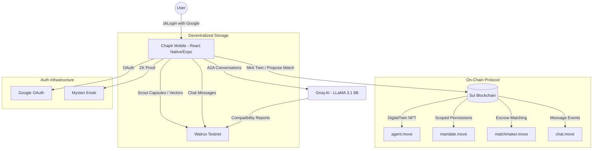
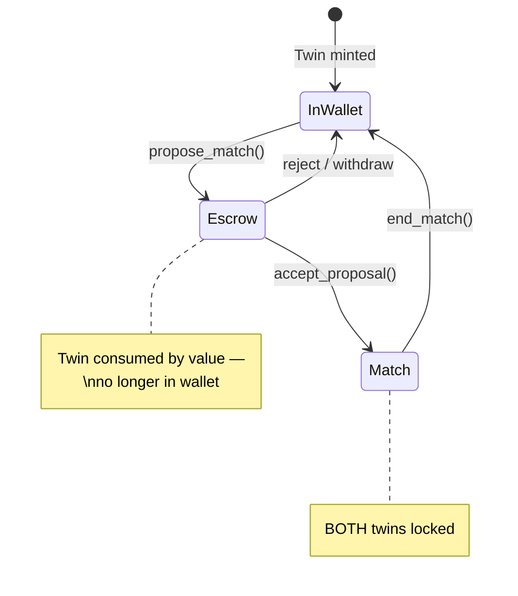
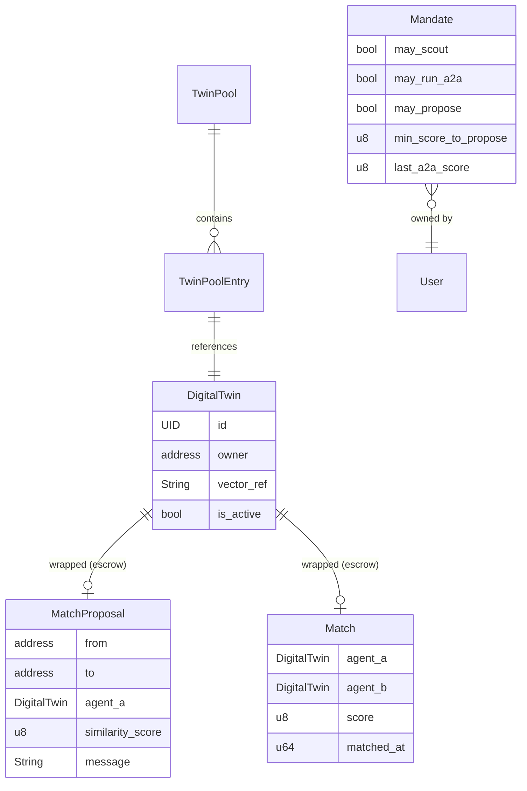

# 💜 Chaptr — Agentic AI Matchmaking on Sui

Chaptr is a next-generation **AI-powered matchmaking protocol** built on the Sui blockchain. Users train personal **Digital Twins** — autonomous AI agents that scout profiles, run agent-to-agent conversations, negotiate compatibility, and propose matches — all with on-chain escrow, zkLogin authentication, and Walrus decentralized storage.

> [!TIP]
> **Check out the [Full Architecture Documentation](./ARCHITECTURE.md)** for a deep-dive into every module, data flow, and on-chain state model.

---

## 🏗️ Architecture

Chaptr is designed as a modular, three-layer system that bridges a premium mobile experience with autonomous on-chain agents and AI-driven compatibility analysis.

### System Overview


### Technical Components

#### 1. **Chaptr Mobile App** — `ai-concierge/`
- **Purpose**: Premium mobile experience for profile creation, Twin training, and human connection.
- **Key Modules**:
  - `Morning Briefing`: AI-powered daily feed — scouts the TwinPool, runs A2A conversations, ranks matches.
  - `AI Twin Chat`: Talk to another person's Digital Twin before seeing their profile (3-message unlock).
  - `Human Chat`: On-chain messaging between matched users via Walrus blobs + Sui events.
  - `Twin Training`: View memory facts, Scout Capsule, and configure autonomous Mandate permissions.
  - `Reflection`: Post-match feedback loop that retrains the Twin (reason tracking, accuracy, block/report).

#### 2. **Sui Smart Contracts** — `chaptr/` + `chaptr_chat/`
- **Purpose**: On-chain identity, scoped autonomy, escrow-based matching, and event messaging.
- **Key Innovation**: The matchmaker uses **physical object wrapping** — your DigitalTwin NFT literally leaves your wallet when you propose, making double-proposals cryptographically impossible.

#### 3. **AI Engine** — `utils/aiEngine.js`
- **Purpose**: Autonomous agent that runs multi-turn A2A conversations between Digital Twins.
- **Workflow**: Build personas from Scout Capsules → 7-message conversation via Groq → JSON compatibility report (score, chemistry, red flags, recommendation) → upload to Walrus → cache locally.

#### 4. **Twin Memory System** — `utils/twinMemory.ts`
- **Purpose**: Persistent personality model with feedback-driven learning.
- **Workflow**: Profile + onboarding → 80 memory facts → Scout Capsule (public dating profile) → published to Walrus → referenced on-chain via TwinPool.

---

## 🔬 Technical Deep-Dive

### 1. The Escrow Matching Pattern (`matchmaker.move`)

Chaptr solves the **exclusivity problem** in decentralized matching. Traditional apps use database flags — Chaptr uses **Sui object wrapping**:



- **Proposing** = `DigitalTwin` taken by value → wrapped inside `MatchProposal` shared object
- **Accepting** = Both twins wrapped inside `Match` shared object  
- **Ending** = Both twins returned to respective wallets via `public_transfer`

> The chain itself enforces that you can't be in two matches or make multiple proposals — your Twin doesn't exist in your wallet anymore.

### 2. Scoped Autonomy (`mandate.move`)

Users control **what their Twin can do** without their approval:

| Permission | Description |
|-----------|-------------|
| `may_scout` | Twin can browse the TwinPool and read scout profiles |
| `may_run_a2a` | Twin can initiate A2A conversations with candidates |
| `may_propose` | Twin can auto-propose if score ≥ threshold |
| `min_score_to_propose` | Minimum compatibility score (70–99) for auto-proposals |

The Mandate is **loosely coupled** from the DigitalTwin — it stays in your wallet even when your Twin is locked in escrow, so you can always update your permissions.

### 3. Dual Blob Architecture (`agent.move` + Walrus)

Each user has two Walrus blobs referenced on-chain:

| Blob | Visibility | Contains | On-Chain Ref |
|------|-----------|----------|-------------|
| **Private Vector** | Encrypted (XOR) | Personality vectors, full memory | `DigitalTwin.vector_ref` |
| **Scout Capsule** | Public JSON | Traits, values, dating intent, communication style, boundaries | `TwinPoolEntry.scout_ref` |

Other twins read your **Scout Capsule** for A2A conversations. Your **Private Vector** stays encrypted and is only accessible with your Sui address.

### 4. zkLogin Authentication (`zkLoginService.ts`)

Users sign in with Google — no seed phrases, no wallet setup:

```
Google OAuth → JWT → Enoki (salt + ZK proof) → Sui Address
```

- Ephemeral Ed25519 keypairs generated per session (`maxEpoch = current + 2`)
- Keys stored in hardware-encrypted `expo-secure-store`
- ZK proof ensures Google identity is **never revealed on-chain**

### 5. Agent-to-Agent Conversations (`aiEngine.js`)

Twin A and Twin B have an autonomous multi-turn conversation:

```
Build Personas → Twin A Opener → 3 Exchange Rounds (7 msgs) → Compatibility Report
```

The report includes: `score` (0–99), `summary`, `chemistry`, `redFlags`, and `recommendation` ("propose" | "pass"). Both the transcript and report are uploaded to Walrus and referenced on-chain via the Mandate.

---

## 📊 On-Chain Data Model



---

## 🛠️ Tech Stack

| Layer | Technology | Details |
|-------|-----------|---------|
| **Mobile App** | React Native 0.81 + Expo 54 | TypeScript, Expo Router v6, Reanimated, Linear Gradient |
| **Smart Contracts** | Sui Move (2024.beta) | 2 packages, 4 modules, testnet deployed |
| **AI Engine** | Groq Cloud | LLaMA 3.1 8B Instant, multi-turn A2A conversations |
| **Authentication** | Sui zkLogin | Google OAuth + Mysten Enoki (salt + ZK prover) |
| **Storage** | Walrus Testnet | JSON blobs (public) + XOR-encrypted vectors (private) |
| **Local Storage** | AsyncStorage + SecureStore | 20+ cache keys + hardware-encrypted keys |

---

## 📁 Project Structure

```
chaptr/
├── ai-concierge/                  # 📱 React Native / Expo mobile app
│   ├── app/                       #    File-based routing (10+ screens)
│   │   ├── index.tsx              #    Landing + zkLogin
│   │   ├── onboarding.tsx         #    9-question personality flow
│   │   ├── profile-setup.tsx      #    6-step wizard + on-chain mint
│   │   ├── (tabs)/index.tsx       #    Morning Briefing (main dashboard)
│   │   ├── chat/[id].tsx          #    AI Twin conversation
│   │   ├── human-chat/[id].tsx    #    Human-to-human chat (on-chain)
│   │   ├── proposals.tsx          #    Incoming match proposals
│   │   ├── twin-training.tsx      #    Memory + Mandate management
│   │   └── reflection.tsx         #    Post-match feedback loop
│   └── utils/                     #    Service layer (9 modules)
│       ├── zkLoginService.ts      #    Google OAuth → ZK Proof → Sui address
│       ├── aiEngine.js            #    Groq A2A conversations
│       ├── twinMemory.ts          #    Memory facts + Scout Capsules
│       ├── matchSync.ts           #    On-chain event synchronization
│       ├── safetyService.ts       #    Block / report / moderation
│       ├── suiTransactions.ts     #    11 transaction builders
│       └── walrusService.ts       #    Walrus blob upload/download
│
├── chaptr/                        # ⛓️ Main Move package (Sui Testnet)
│   └── sources/
│       ├── agent.move             #    DigitalTwin NFT + TwinPool registry
│       ├── mandate.move           #    Scoped autonomy permissions
│       ├── matchmaker.move        #    Escrow-based match proposals
│       └── chaptr.move            #    Package module
│
├── chaptr_chat/                   # ⛓️ Chat Move package (separate)
│   └── sources/
│       └── chat.move              #    Event-only messaging (Walrus blobs)
│
└── sui-contracts/                 # 🔧 Sui node binaries (testnet v1.40.1)
```

---

## 🔐 Security

- **zkLogin**: Zero-knowledge proofs ensure Google identity is never revealed on-chain
- **Physical Escrow**: Object wrapping prevents double-proposals at the blockchain level
- **Encrypted Storage**: Private personality data XOR-encrypted on Walrus; keys in hardware SecureStore
- **Owner-Only Mutations**: All smart contract functions verify `sender == owner`
- **Content Safety**: Block/report system with Walrus persistence and Twin training feedback loop
- **Score Enforcement**: Minimum score of 70 enforced on-chain in `matchmaker.move`

---

## ⚙️ Deployed Contracts

| Package | Sui Testnet Address | Version |
|---------|-------------------|---------|
| `chaptr` | `0x715ce4a6a2180c22f89243a2e1a0eca5ed0ad1b33a9fda2a6986f538ce4ca31c` | v1 |
| `chaptr_chat` | `0xa767f4fb74ede5adade9001f18bb159206d30b4f2dc77ec36b2b73a62eb401b4` | v1 |
| TwinPool (shared) | `0x5ca4a4db5dbb17c841dd61417cc9cb035bde33323eceb27848f1752267384653` | — |

---

## 🚀 Getting Started

### Prerequisites
- Node.js 18+
- Expo CLI (`npx expo`)
- Sui CLI (for contract deployment)

### Run the Mobile App
```bash
cd ai-concierge
npm install
npx expo start
```

### Build & Deploy Contracts
```bash
cd chaptr
sui move build
sui client publish --gas-budget 100000000

cd ../chaptr_chat
sui move build
sui client publish --gas-budget 100000000
```

---

## 📄 License

MIT

---

<p align="center">
  <b>Built with 💜 on Sui · Powered by Walrus · Secured by zkLogin</b>
</p>
