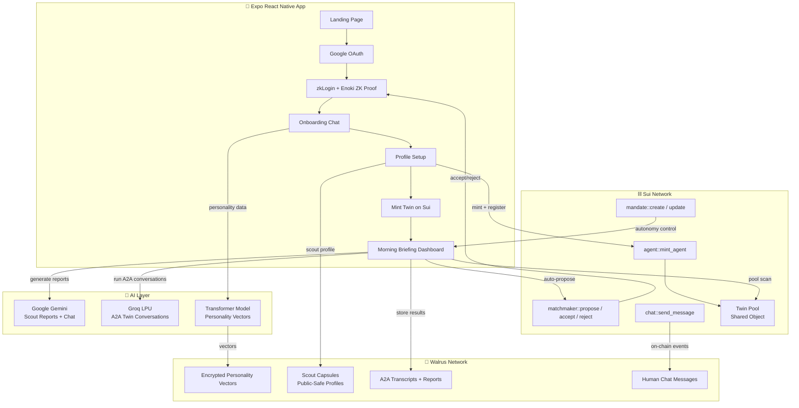
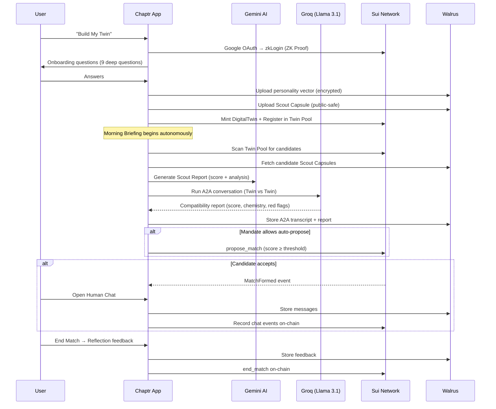

<p align="center">
  <h1 align="center">Chaptr.</h1>
  <p align="center"><strong>Your Twin. Your Story.</strong></p>
  <p align="center">
    Autonomous AI-mediated dating powered by Sui, Walrus, and zkLogin.
  </p>
</p>

---

## The Problem

Modern dating apps are optimized for **engagement**, not connection. They rely on endless, superficial swiping and algorithms designed to keep you *on* the app — not get you *off* it.

## The Solution

**Chaptr** replaces the swipe with a sovereign **Digital Twin** — an autonomous AI agent that learns your humor, values, and boundaries, then scouts the network for deeply compatible matches on your behalf.

You train it once. It works 24/7. You only meet the people who actually matter to your story.

---

## Architecture Overview



---

## User Flow



---

## Tech Stack

| Layer | Technology | Purpose |
|-------|-----------|---------|
| **Frontend** | React Native (Expo) + Expo Router | Cross-platform app with file-based routing |
| **Blockchain** | **Sui Network** (Testnet) | Ultra-fast L1 for agent logic, matching, mandates, and chat events |
| **Storage** | **Walrus Network** | Decentralized, immutable storage for vectors, profiles, transcripts, and messages |
| **Auth** | **Sui zkLogin** + Google OAuth + Enoki | Zero-knowledge authentication — Web2 login, Web3 security |
| **AI (Reports)** | **Google Gemini** | Scout report generation, AI Twin chat personas |
| **AI (A2A)** | **Groq** (Llama 3.1 8B) | Blazing-fast Agent-to-Agent conversations between Digital Twins |
| **Embeddings** | **Transformers.js** (Web Worker) | On-device personality vector generation |
| **Key Management** | Ephemeral Keys + Expo SecureStore | Session-scoped keys, never stored permanently |

---

## On-Chain Architecture (Sui Move)

Four Move modules power the on-chain logic:

```
┌─────────────────────────────────────────────────────┐
│                    Sui Testnet                       │
├──────────────┬──────────────┬────────────┬───────────┤
│    agent     │  matchmaker  │  mandate   │   chat    │
├──────────────┼──────────────┼────────────┼───────────┤
│ mint_agent   │ propose_match│ create     │ send_msg  │
│ register     │ accept       │ update     │           │
│              │ reject       │ record_a2a │           │
│              │ withdraw     │            │           │
│              │ end_match    │            │           │
└──────────────┴──────────────┴────────────┴───────────┘
```

- **agent** — Mints a DigitalTwin NFT and registers it in the shared Twin Pool.
- **matchmaker** — Full proposal lifecycle: propose → accept/reject → end match.
- **mandate** — On-chain autonomy control. Defines what the Twin may do without human approval (scout, run A2A, auto-propose) and the minimum compatibility score threshold.
- **chat** — Records human-to-human chat message events on-chain (content stored on Walrus).

---

## Key Features

### 🤖 Autonomous Digital Twin
Your AI agent learns your personality through a deep conversational onboarding, compiles it into high-dimensional memory vectors, and acts as your autonomous scout in the network.

### 🧠 A2A Conversations (Agent-to-Agent)
Twins don't just compare scores — they **talk to each other**. Using Groq's ultra-fast LPUs, two Digital Twins engage in multi-turn dialogue to assess chemistry, compatibility, and red flags before any human interaction occurs.

### 📜 The Mandate (Autonomy Control)
You decide how autonomous your Twin should be:
- **Full autonomy** — Scout, converse, and auto-accept matches above your score threshold.
- **Semi-autonomy** — AI fetches and ranks profiles, but you manually review and decide.
- **Chat with your agent** — Talk to your Twin to debate *why* it recommended someone before accepting.

### 🔒 Zero-Knowledge Authentication
Users authenticate via familiar Google sign-in, but under the hood, **Sui zkLogin** generates a Zero-Knowledge proof — your private keys are never exposed, and your on-chain identity remains cryptographically secure.

### 🐋 Decentralized Data Ownership
All personality vectors, scout profiles, A2A transcripts, and chat messages are stored on the **Walrus Network**. You cryptographically own your psychological profile — no central authority can alter or monetize it.

### 🔄 Feedback Loop & Twin Training
Every interaction trains your Twin. Match reflections, chat feedback signals, safety reports, and blocks all feed back into the Scout Capsule, making your agent smarter and more aligned over time.

### 🛡️ Safety & Reporting
Built-in blocking, hiding, safety reporting (harassment, fake profiles, inappropriate content), all persisted locally and optionally uploaded to Walrus for decentralized auditability.

---

## Project Structure

```
ai-concierge/
├── app/
│   ├── index.tsx              # Landing page + Google Connect
│   ├── onboarding.tsx         # 9-question Twin onboarding
│   ├── profile-setup.tsx      # Profile creation + Twin minting
│   ├── proposals.tsx          # Incoming/outgoing proposal management
│   ├── reflection.tsx         # Post-match feedback & learning
│   ├── twin-training.tsx      # Twin dashboard + Mandate management
│   ├── judge.tsx              # Telemetry dashboard for judges
│   ├── chat/[id].tsx          # AI Twin chat (Gemini-powered)
│   ├── human-chat/[id].tsx    # Human-to-human chat (Sui + Walrus)
│   ├── (tabs)/
│   │   ├── index.tsx          # Morning Briefing / Main dashboard
│   │   └── explore.tsx        # Agent Settings (V2)
│   └── _layout.tsx            # Root navigation stack
├── utils/
│   ├── aiEngine.js            # A2A conversation engine (Groq)
│   ├── matchSync.ts           # On-chain match discovery + auto-accept
│   ├── twinMemory.ts          # Twin memory system + Scout Capsule
│   ├── walrusService.ts       # Walrus upload/download + encryption
│   ├── suiTransactions.ts     # Sui Move transaction builders
│   ├── zkLoginService.ts      # zkLogin auth flow (Google + Enoki)
│   ├── safetyService.ts       # Blocking, reporting, feedback
│   └── telemetry.ts           # Event ledger for judge dashboard
├── constants/
│   └── theme.ts               # Color scheme + font definitions
└── assets/                    # Images and static assets
```

---

## Getting Started

### Prerequisites
- Node.js 18+
- npm or yarn

### Installation

```bash
# Clone the repo
git clone https://github.com/Abhay-PratapSingh-ctrl/Chaptr.git
cd Chaptr/ai-concierge

# Install dependencies
npm install

# Create your .env file with required API keys
cp .env.example .env
```

### Environment Variables

```env
EXPO_PUBLIC_GOOGLE_CLIENT_ID=       # Google OAuth Client ID
EXPO_PUBLIC_ENOKI_API_KEY=          # Mysten Enoki API Key (zkLogin)
EXPO_PUBLIC_GEMINI_API_KEY=         # Google Gemini API Key
EXPO_PUBLIC_GEMINI_MODEL=           # Gemini model (e.g. gemini-3.5-flash)
EXPO_PUBLIC_GROQ_API_KEY=           # Groq API Key (A2A conversations)
EXPO_PUBLIC_PACKAGE_ID=             # Main Sui Move package ID
EXPO_PUBLIC_TWIN_POOL_ID=           # Twin Pool shared object ID
EXPO_PUBLIC_CHAT_PACKAGE_ID=        # Chat module package ID
EXPO_PUBLIC_MANDATE_PACKAGE_ID=     # Mandate module package ID
```

### Run the App

```bash
# Start the development server
npx expo start --web
```

---

## Built For

**Sui Overflow Hackathon** — Agentic Track

We believe the most profound, untapped frontier for autonomous agents isn't financial — it's **social identity** and human connection.

---

<p align="center">
  <strong>Stop swiping. Start your story.</strong>
</p>
